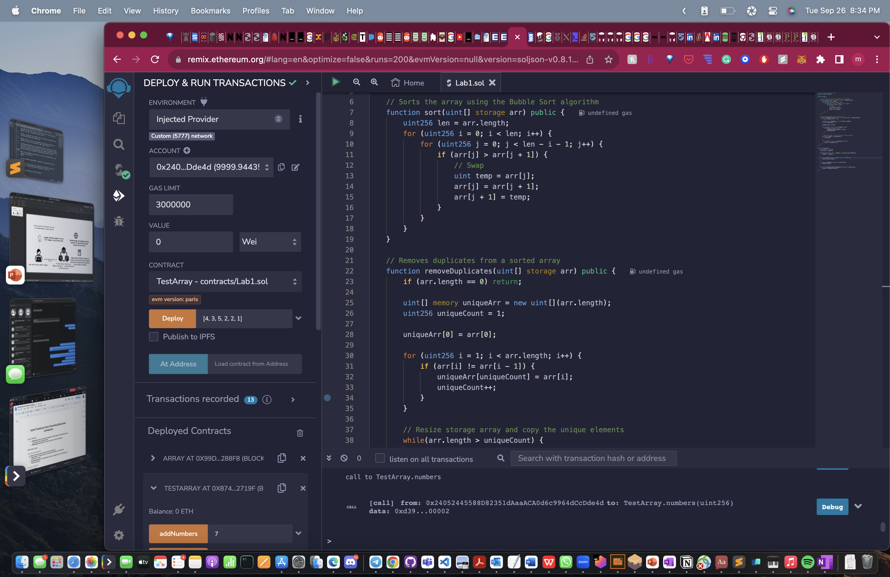
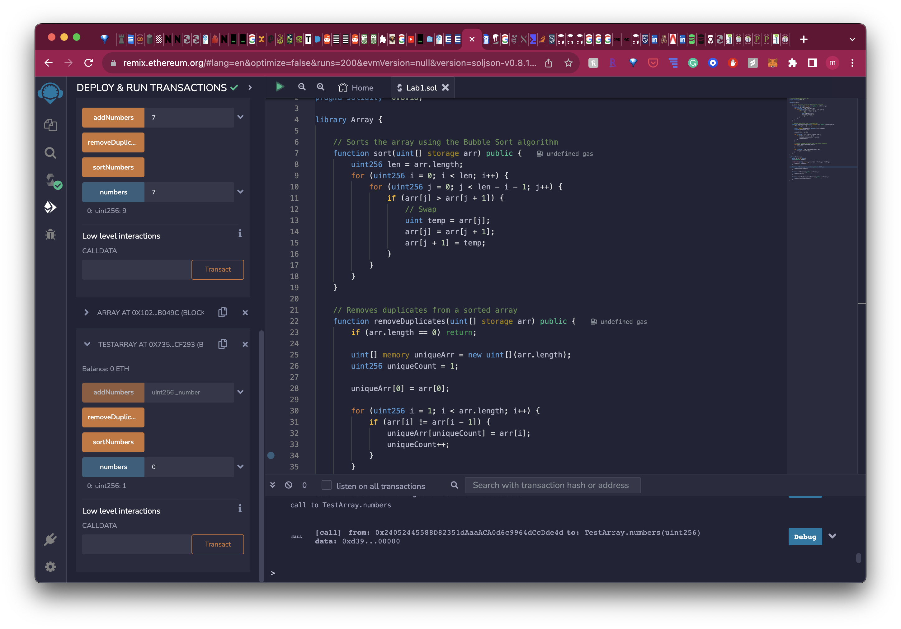
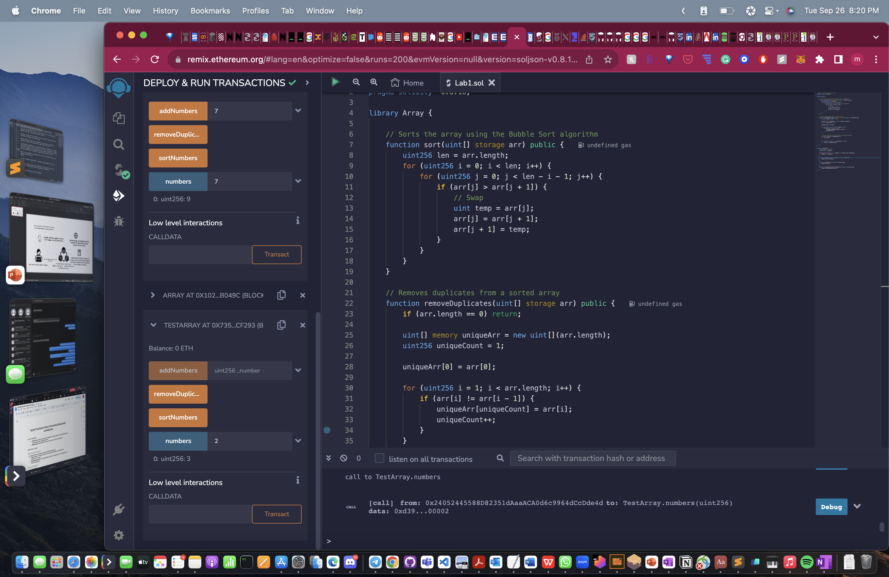

# Blockchain

Repo of Blockchain Projects and files

## Lab 1 screenshots

### Deployed Contract with Array

### After sorting Numbers, It becomes

**First Element**

**Last Element**

### Then if you recall our initial Array, had multiple 2's

**Before it is removed, 2^nd^ and 3^rd^ index has 2**

**After removing duplicates, 3rd index becomes 3 as shown below**

